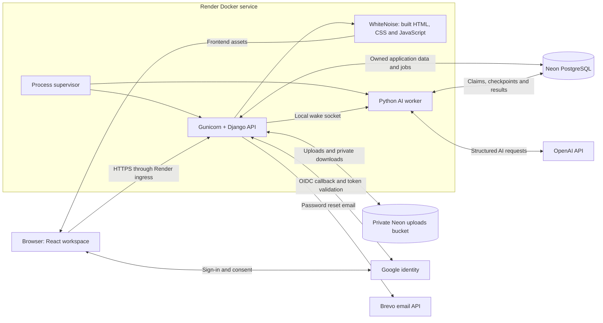
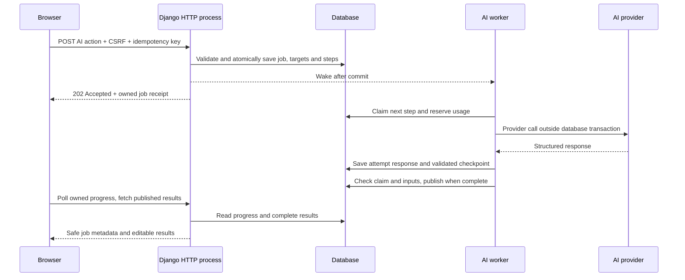

# Architecture

Graider is a teacher-owned grading workspace. React handles editing and navigation; Django owns authentication, validation and persistence; a separate Python process performs AI work. Production packages the frontend, HTTP server and worker in one Docker image, with data stored outside the application container.

## High-level system

Render's ingress terminates HTTPS and forwards requests to Gunicorn. Django returns the SPA entry page for frontend routes, JSON for API routes and server-rendered pages for admin, public information and privacy. WhiteNoise serves versioned build assets. React renders in the browser and fetches data as needed; production does not run a Vite/Node frontend server or a separate Apache service.

Local Docker replaces Neon with persistent SQLite and upload volumes. Source development runs Vite, Django and the AI worker separately. Vite proxies `/api` and `/accounts` to Django while preserving the browser hostname for session cookies and OAuth callbacks.

## Components and boundaries

| Component                | Responsibility                                                                         | Code                                                                                                     |
| ------------------------ | -------------------------------------------------------------------------------------- | -------------------------------------------------------------------------------------------------------- |
| React workspace          | Assignment editors, submission tables, review, draft protection and owned job progress | [pages](../frontend/src/pages), [job provider](../frontend/src/components/AIJobsProvider.tsx)            |
| Accounts                 | Password/session authentication, Google linking, recovery and staff login              | [accounts](../backend/apps/accounts)                                                                     |
| Assignments              | Source ingestion, questions/shared context, marks and readiness                        | [assignments](../backend/apps/assignments)                                                               |
| Grading domain           | References, rubrics, submissions, criterion validation, manual review and CSV          | [grading](../backend/apps/grading)                                                                       |
| Job admission            | Freeze validated inputs, enforce idempotency/targets/queue limits, persist work        | [services.py](../backend/apps/ai_jobs/services.py), [snapshots.py](../backend/apps/ai_jobs/snapshots.py) |
| Scheduling and execution | Claim steps, renew leases, recover interrupted work, select jobs fairly                | [engine.py](../backend/apps/ai_jobs/engine.py), [runtime.py](../backend/apps/ai_jobs/runtime.py)         |
| AI boundary              | Build prompts from frozen inputs, validate structured outputs and record usage         | [recipes.py](../backend/apps/ai_jobs/recipes.py), [accounting.py](../backend/apps/ai_jobs/accounting.py) |
| Publication              | Compare current inputs, protect teacher edits and commit complete results              | [publication.py](../backend/apps/ai_jobs/publication.py)                                                 |
| Container lifecycle      | Apply migrations, check settings, supervise web and worker                             | [start.sh](../backend/start.sh), [supervisor.py](../backend/supervisor.py)                               |

Manual edits, imports, file extraction and exports are ordinary HTTP operations. AI action handlers only admit work; they never run the provider request inline. Generated OpenAPI uses runtime serializers plus declarations on custom views. Swagger UI is public, but its API actions retain normal session, CSRF, ownership and quota checks.

## Frontend state and API contracts

React Router selects the workspace page; TanStack Query caches server records by account/assignment/submission and refreshes affected queries after mutations. Editors keep local drafts separately from fetched data. A shared draft registry validates and saves changes before navigation; job completion refreshes roster/dashboard metadata immediately but defers editor refresh while drafts are dirty.

`AIJobsProvider` discovers owned active/recent jobs after sign-in, refresh and navigation. It expands batch children, drives scoped controls and polls only visible runnable work, with error backoff. A valid receipt enters the query cache immediately. The API client includes session cookies and the CSRF header; lost/malformed admission responses retain an owner-scoped key in session storage for idempotent retry. This is request identity persistence, not storage of unsaved answer drafts.

DRF serializers validate public payloads and describe the API contract; Pydantic schemas validate AI outputs. Job APIs expose safe progress/errors and result references rather than private input snapshots, response checkpoints or provider identifiers. Review data is validated before rendering and unexpected page errors have a safe fallback.

## Data model

```mermaid
erDiagram
    User ||--o{ Assignment : owns
    Assignment ||--o{ QuestionPart : contains
    QuestionPart ||--o| ReferenceAnswer : has
    QuestionPart ||--o{ RubricCriterion : defines
    Assignment ||--o{ StudentSubmission : receives
    Assignment ||--o{ SubmissionImport : imports
    StudentSubmission ||--o{ SubmissionAnswerPart : maps
    QuestionPart ||--o{ SubmissionAnswerPart : identifies
    StudentSubmission ||--o{ GradingResult : receives
    QuestionPart ||--o{ GradingResult : scores
    User ||--o{ AIJob : requests
    AIJob ||--o{ AIJob : groups
    AIJob ||--o{ AIJobTarget : claims
    AIJob ||--o{ AIJobStep : sequences
    AIJobStep ||--o{ AIJobAttempt : records
    AIJobAttempt |o--o| LLMUsage : accounts
    User ||--o{ LLMUsage : consumes
```

`QuestionPart` separates scored questions from unscored shared context. Internal keys are unique per assignment; displayed question numbers are separate labels. A question has one reference answer and multiple rubric criteria. Each submission has mapped answers and a result per scored question.

`GradingResult` stores separate AI/final scores and feedback, plus a JSON snapshot of rubric criteria and their individual scores. Totals use decimal arithmetic. The snapshot preserves the rubric used for a published result when live criteria later change. It is not a full revision/audit history.

Job records have distinct roles:

| Record             | Stored information and constraint                                                                                                               |
| ------------------ | ----------------------------------------------------------------------------------------------------------------------------------------------- |
| `AIJob`            | Owner, operation, immutable input snapshot/fingerprint, versions, progress, safe error and result reference. A batch groups child student jobs. |
| `AIJobTarget`      | One active job per affected target, preventing overlap between single and bulk actions.                                                         |
| `AIJobStep`        | Ordered unit of work, checkpoint, current claim token and expiring lease.                                                                       |
| `AIJobAttempt`     | Dispatch outcome, saved provider response and linked usage record for each attempt.                                                             |
| `LLMUsage`         | Token reservation/actual usage and outcome, retained independently of job cleanup.                                                              |
| `AIJobCoordinator` | Singleton row locked during short scheduling/admission/accounting transitions to coordinate concurrent processes.                               |

Original files remain in a private bucket under separate assignment, submission and import prefixes. One bucket is sufficient: access checks depend on the owning teacher, not a public bucket or predictable filename. The S3/AWS environment names come from the compatible storage client. They do not require an AWS account. File download endpoints authenticate the teacher before returning content.

## Background execution at a lower level

Claims expire unless renewed by heartbeats. A unique claim token fences an old worker: losing a lease prevents it from overwriting a successor's work. Completed responses and checkpoints are reusable after restart. A dispatched request with no recoverable response becomes `needs_attention`, because the provider may have charged for it. It is never silently repeated as if it were free.

Snapshots freeze assignment/question/reference/rubric/submission inputs, task model/reasoning and snapshot/prompt/output versions. The worker checks supported versions and compares inputs before execution/publication. Changed or deleted inputs supersede unfinished work. Independent reference/rubric jobs guard their own targets without invalidating unrelated artifact work.

The coordinator lock and constraints protect global concurrency and quota reservations across overlapping worker processes. Locks are held only for database transitions; provider waits occur outside transactions. SQLite uses one execution thread and short immediate transactions; PostgreSQL supports configured concurrency. The coordinator is deliberately simple for a small demo and could become a bottleneck at much larger scale.

## Main design decisions

| Decision                                          | Reason and consequence                                                                                                                                                                       |
| ------------------------------------------------- | -------------------------------------------------------------------------------------------------------------------------------------------------------------------------------------------- |
| One origin and one Docker service                 | Simplifies cookies, CSRF, deployment and frontend delivery. Web and AI processes share the service's CPU/RAM and sleep lifecycle.                                                            |
| Separate worker process from Gunicorn             | HTTP worker restarts/timeouts do not own AI execution. The supervisor exits if either child dies so the container can recover.                                                               |
| PostgreSQL-backed queue, without Redis/Celery     | Durable work and application data use the same transaction system without another hosted service. Requires explicit scheduling/recovery logic and suits the bounded demo workload.           |
| Local wake socket, active scans only              | Accepted jobs remain in the DB; notifications wake a colocated worker. Startup/progress wakeups recover missed notifications. Idle workers close DB connections and avoid periodic DB scans. |
| Rolling student concurrency, sequential questions | Limits cost/load while publishing one complete student at a time. Interactive generation can run between grading steps; fairness promotes waiting jobs.                                      |
| Atomic publication                                | Private checkpoints never expose half of a student's replacement grade. Previous results remain visible during regrading.                                                                    |
| Explicit linking and teacher review               | Matching emails never merge accounts automatically. AI proposes marks/feedback; teachers can edit and must satisfy completeness checks before finalization.                                  |
| Versioned checkpoints and conservative retries    | Recover known saved work; require acknowledgement when another request may incur a duplicate charge. This is not an exactly-once guarantee for an external provider.                         |
| Persistent private files and additive migrations  | Redeployments preserve uploads, accounts and grades. Existing databases are upgraded rather than reset.                                                                                      |
| Build-once image delivery                         | CI validates code, packages static assets and publishes immutable commit tags. Render's hook deploys the passing commit image.                                                               |

## Authentication and security

Password and Google sign-in establish Django sessions. Mutating requests require CSRF protection; endpoints scope objects and jobs to their teacher. Auth requests are rate limited. Production enables secure cookies, HTTPS/proxy handling and security headers; credentials stay in environment settings, never frontend bundles.

Google OIDC uses django-allauth's OAuth flow with state/PKCE and explicit signed ID-token validation, including issuer/audience, nonce, expiry and verified identity. Only basic identity is requested; provider tokens are not retained. Account linking requires an authenticated explicit action. Google admin sign-in requires an existing active staff account with Google already linked and never grants staff permission.

Uploads, PDF pages, text lengths, CSV rows, queue size, simultaneous calls and token budgets are bounded. AI output is schema-validated and checked against domain constraints. These controls do not prove resistance to prompt injection or grading quality; see [AI quality improvements](ROADMAP.md#ai-quality). Operational settings are in [setup](SETUP.md); execution details are in [grading](GRADING.md).
