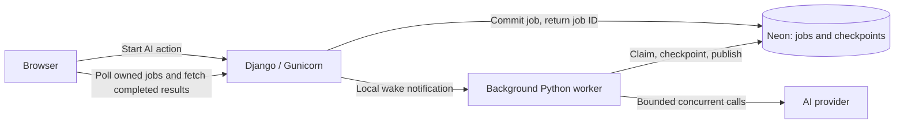

# Background AI jobs: design and execution plan

Status: proposed implementation, ready for owner review. This document is the first commit; no job implementation is included yet.

Branch: `feat/background-ai-jobs`, based on the merged production-deployment PR.

## Decision and scope

Use design 1: one background worker process in the same Render container as Django/Gunicorn. Neon PostgreSQL stores the queue, inputs, progress and checkpoints. Keep the existing Python AI services, private upload storage, session authentication and usage controls. No Celery, Redis, Inngest, Neon Functions, separate worker service, paid hosting or recurring manual renewal is required.

Move every user-triggered AI operation onto the shared job system: question extraction, reference-answer generation, rubric generation, answer mapping and submission grading. Mapping is an internal grading step rather than a new public button. Manual edits, uploads, file-text preview, finalization and exports remain ordinary requests.

The acceptance target is a demo batch of up to ten eligible submissions with up to ten questions each. Default to three concurrent AI calls, configurable through environment variables. Concurrency can be tuned after measurement; completing every batch within fifteen minutes is a target, not a guarantee or a correctness dependency.

## Required behavior

1. An AI request validates and saves its job, then returns `202 Accepted` with a job ID without waiting for the provider. A durable database job, rather than an in-memory thread or notification, is the accepted work.
2. Students run concurrently with a rolling limit. When one finishes, publish that student's complete result immediately and start another; never wait for the whole batch to finish.
3. Within one submission, map answers first, then grade questions sequentially. Save each completed step privately. Publish all questions, criterion scores/feedback and totals for that student together in one transaction.
4. A queued student can wait for a concurrency slot. A completed student never waits for another student's results. A failed student does not stop other eligible students.
5. Browser refresh, navigation and logout do not lose accepted work. Authorized users rediscover active jobs and poll progress when they return.
6. After a crash or restart, reuse saved mapping and question checkpoints. Never deliberately rerun completed provider steps just to rebuild a submission's final result.
7. After Render sleeps, unfinished work resumes when an incoming request wakes the service. This design does not promise completion while Render is stopped.
8. Preserve teacher edits, existing published grades, reviewed/finalized work, quotas, safe errors, CSRF and owner isolation. Regrading and destructive generation remain explicit choices.
9. All operational settings are grouped and documented in `.env.example`; ignored credential dotenv files use the same quoted formatting. No credentials enter Git or browser bundles.
10. Each execution-plan step is exactly one commit. Stop after each commit for owner review before starting the next step.

## Architecture and process lifecycle

The worker is a separate process, not a thread created inside a request or an import-time Django hook. It remains design 1 because both processes share one container, memory allowance and CPU. Separating it from Gunicorn prevents normal web-worker recycling (`max_requests`) from discarding grading threads.

A small Python supervisor starts Gunicorn and `run_ai_worker` after the existing migrations and settings checks. It forwards termination signals, reaps children and stops both if either managed process dies. The hosting platform restarts the service; startup scans durable unfinished work. No second Render service is provisioned. Production startup runs exactly one worker coordinator; bounded threads inside it execute steps. Leases still protect against overlapping old/new containers during deployment.

Do not start workers in every Gunicorn process, Django autoreloader, test runner or migration command. For source development, run the explicit worker command beside Django/Vite. Docker Compose starts it through the same supervised entry point, preserving the existing local database/upload volumes.

On termination, stop claiming jobs, allow bounded in-flight work to finish within the configured drain interval, save results when possible, then exit. Work surviving only in memory is never treated as completed. An expired claim can be recovered after restart.

### Wake-up without continuous idle database polling

Use a local Unix socket notification after the enqueue transaction commits. The socket is private to the container and carries a wake signal, not prompts or credentials. Jobs remain discoverable if notification delivery fails.

The worker scans on service startup and on notifications. While jobs, retry timers or claims exist, it performs bounded recovery scans. When truly idle, it waits locally instead of polling Neon every few seconds; constant idle polling could keep the database awake and consume its free compute allowance.

Gunicorn worker startup also sends a recovery notification, covering a web-process crash between committing a job and notifying the worker. Reading owned active-job progress nudges recovery as well. If Render itself is stopped, these mechanisms run only after inbound traffic restarts it. A supervisor/worker failure must be visible through readiness and logs rather than silently accepting indefinitely stalled work.

## Durable records

Add an `ai_jobs` Django app with additive migrations. Do not reset production or rewrite applied migrations.

| Record                | Purpose and important fields                                                                                                                                                                                                            |
| --------------------- | --------------------------------------------------------------------------------------------------------------------------------------------------------------------------------------------------------------------------------------- |
| `AIJob`               | UUID, owner, operation, optional parent batch, target IDs, input snapshot/hash, job schema version, priority, state, current step, timestamps, retry time, cancellation flag, safe error, result reference and enqueue idempotency key. |
| `AIJobStep`           | Job plus unique stable step key, input hash, state, validated staged output, lease token/expiry, heartbeat and attempt count. Mapping, each question and publication have separate keys.                                                |
| `AIJobAttempt`        | Step attempt, dispatch state, linked existing usage reservation, provider request ID where available, timings and safe failure classification. No credentials or full provider errors.                                                  |
| `AIWorkerCoordinator` | Short locked record for claiming slots and enforcing the global configured limit across overlapping worker processes. No lock is held during provider waits.                                                                            |

Snapshots include assignment/shared context, ordered question IDs/text/marks, reference answers, rubric criteria, submission text, model, reasoning, prompt version and output schema version. One batch uses a consistent assignment snapshot. Copy only the required bounded inputs; never store API keys in jobs. Private text stays in the existing private database and is sent only to the configured provider as today.

Step outputs are checkpoint data, not partially published `GradingResult` rows. Parent batches aggregate child states/counters and do no provider work. Completing the last child updates the parent atomically; recovery can recompute its summary from children after interruption.

Suggested states: `queued`, `running`, `retry_wait`, `paused_quota`, `needs_attention`, `succeeded`, `failed`, `cancelled` and `superseded`. Parent summaries distinguish full success, partial failure, cancellation and work requiring attention. Runtime status is independent of the submission's existing published review status.

Completed diagnostics/checkpoints can be pruned after seven days and failed/uncertain diagnostics after thirty days, using bounded cleanup while the worker is already active. Never prune active work or the existing published answers/grades. Retain minimal completion/idempotency receipts separately for thirty days so pruning large snapshots does not cause a refreshed client to create duplicate work. Cascading account deletion removes private job inputs too. No new timed provider subscription is involved.

## Admission, API and duplicate protection

Keep the existing AI action URLs, changing their final contract from synchronous results to a shared `202` job receipt. Bulk actions return the parent ID and child IDs. Runtime serializers automatically update OpenAPI/Swagger.

Add owner-scoped job list/detail, cancel and explicit resume/retry endpoints under `/api/ai/jobs/`. Lists can be filtered by assignment, operation and active state so a page can recover work without relying on local storage. Progress includes completed/total students and questions, current stage, per-child state and safe errors. Result references use existing owner-scoped artifact endpoints; public status responses never expose prompts or staged partial grades.

Submission grading checks ownership, setup completeness and the ten-question cap before admission. Grade all defaults to ungraded/failed eligible work; exclude successful, reviewed, finalized and already-active targets unless explicit permitted regrading was chosen. The default batch cap is ten eligible submissions, not ten rows including completed work. Larger selections receive a clear response asking for a smaller selection. Single and bulk enqueue paths share the same active-target protection.

The frontend creates an idempotency key for each deliberate action and reuses it when retrying an uncertain enqueue response. Uniqueness is scoped to owner; reusing a key with different inputs returns a conflict. Concurrent requests for the same target and operation cannot create competing active jobs even with different keys. A deliberate regrade after completion receives a new key. All request mutations keep session/CSRF checks and existing throttling; add bounded per-owner/global active-queue admission limits as separate controls from billed AI usage.

Validate and create the parent, children and snapshots atomically, then notify on commit. If the notification is lost, startup/progress recovery finds the records. A notification failure after the database commit must not turn an accepted job into a false admission error. If admission fails, accept no partial batch. A worker unavailable in jobs mode yields an explicit unavailable response; don't claim success for a job that cannot be serviced.

## Concurrency, fairness and grading

The scheduling unit is one resumable step. No job has two provider steps running concurrently. The global limit initially allows three in-flight AI calls; it covers grading and every generation action together. Missing student answers create zero-score checkpoints without a provider call.

Maintain a rolling window of up to three active student jobs by default. Prefer their next question over starting more students so early students finish promptly. Interactive generation has higher priority and can run between grading questions; aging prevents either class from starving. It does not interrupt an in-flight request. Open a new student slot immediately after completion, cancellation, terminal failure or a job entering a paused state. A slow student doesn't block the other slots.

Claims are short transactions using PostgreSQL row locks and unique constraints. Close stale/thread-owned Django connections appropriately, keep connection counts bounded and perform all network waits outside transactions. The coordinator records claims globally rather than relying solely on process memory. SQLite Docker/source development uses one coordinator and serialized bounded writes; verify its compatibility separately. PostgreSQL is the authority for concurrency guarantees.

For one student, the final publication transaction validates every expected question/criterion, score bound, rubric total and snapshot hash, then updates answer parts, criterion results, calculated totals and final status together. A completed child is readable immediately, even while its siblings run. Stage regrading separately so the last published result remains visible until replacement succeeds. Preserve teacher criterion/question overrides according to the current rules; invalidate finalization only when a replacement is successfully published.

## Changes while work is running

Snapshot the inputs at admission and recheck their version/hash before publication. Editing or deleting required source questions, answers, rubrics or student text supersedes affected unfinished jobs. Ignore late results rather than applying them to newer content. Cancel remaining child jobs for an assignment-wide input change; already published students retain their historical snapshot and visible version. This step prevents new queued results from silently using changed inputs; relabeling all historical grades after later edits remains the separately deferred UX finding 15.

Generation saves valid edited drafts before admission, fills missing content by default, and asks for confirmation before explicit replacement. Bulk reference/rubric generation is staged and published atomically for the requested action, retaining the current protection against partial destructive replacement. Question extraction publishes the complete validated question set together. Per-question generation publishes that answer or rubric when its job finishes. Recheck missing targets and versions before publishing, preserving teacher content added during the wait.

An active job may be cancelled when the target is edited. Review/finalize/another grading operation cannot race publication: use the same target lock/active-job guard. Return clear conflict/status details so the UI can offer cancel or wait. Administrative changes bypassing app views are still detected by the publication hash check.

## Crashes, retries and billed uncertainty

Use expiring leases with heartbeats. Every checkpoint and publication verifies the current lease token; an older worker cannot write after a newer claim takes ownership. A new claim waits for expiry, then starts at the first unfinished step. Completed checkpoints survive a Render restart, browser logout and frontend refresh.

Persist an attempt and link its usage reservation before dispatch. Reserve through the existing PostgreSQL quota mechanism for every actual attempt. Explicitly record dispatch as potentially in flight before making the network call; after success, reconcile usage and persist the validated checkpoint. Do not clear uncertain reservations just because the worker disappeared.

| Interruption                                                 | Recovery                                                                                                                                    |
| ------------------------------------------------------------ | ------------------------------------------------------------------------------------------------------------------------------------------- |
| Before a provider dispatch could occur                       | Reclaim and execute the unfinished step.                                                                                                    |
| After a saved mapping/question checkpoint                    | Reuse it; no repeat provider call.                                                                                                          |
| After possible dispatch but before a durable response        | Mark `needs_attention`; do not automatically repeat a possibly billed request. Offer an explicit retry with a duplicate-charge explanation. |
| After durable response but before publication                | Validate/publish saved output without calling AI again.                                                                                     |
| During final publication                                     | The transaction either commits completely or recovery repeats publication from checkpoints.                                                 |
| After a child completes but before the parent counter update | Recompute batch counters from durable child state.                                                                                          |

Automatically retry only explicitly classified safe transient failures with bounded exponential backoff/jitter and a maximum attempt count. Provider timeouts/connection loss, uncertain server failures and process death after possible dispatch are not blindly retried. Malformed output fails safely unless the owner deliberately retries. Quota exhaustion pauses unstarted work and requires deliberate resume when allowance is available; configuration/authentication failures stop with a safe message. Ordinary progress reads never authorize another possibly billed attempt.

Cancellation prevents new steps and publication. A running provider request may still finish and cost money; discard its staged result for publication if cancellation wins. Cancelling a parent requests cancellation for unfinished children, leaving completed students and previous published grades intact.

No design can resume an external API request halfway through or guarantee exactly one billable call across every crash. The guarantee is durable completed checkpoints, guarded publication and conservative handling of uncertain attempts.

## Frontend behavior

Use one typed job client and polling hook for all AI buttons. Show immediate queued/running status with the existing AI icon/theme and a spinner only on the affected action. Disable competing actions on that target while retaining access to other pages, other students and existing published results.

Poll every three seconds while the page is visible, back off on connection errors, and pause unnecessary polling in hidden tabs. Rediscover jobs from the server on mount, refresh and sign-in. A jobs indicator in the profile/workspace links to active work and completed/failed actions. Polling or that indicator must not depend on keeping the original assignment page mounted. Stop polling terminal jobs.

Submission tables show queued/running progress and update a student's grade/Review link as soon as that child succeeds. A review page can show prior complete grades during regrading, but never exposes a partial new set. Parent progress does not delay child cache invalidation. Completed generation invalidates the affected queries without replacing unrelated dirty drafts. Show safe retry/cancellation/superseded/uncertain outcomes and require explicit confirmation when retry could duplicate charges.

Saving and leaving still protects teacher drafts. Leaving after a job was accepted does not cancel it; explain that work continues while the service is awake. No real student text, reset links or secrets enter local storage or job notifications. Frontend recovery comes from the authenticated server records.

## Configuration and free-host constraints

Proposed settings, to be validated during implementation:

| Variable                            | Initial value                                             | Purpose                                                                   |
| ----------------------------------- | --------------------------------------------------------- | ------------------------------------------------------------------------- |
| `GRAIDER_AI_JOBS_ENABLED`           | `false` during staged commits; `true` at approved cutover | Coordinate worker, API contract and frontend rollout.                     |
| `GRAIDER_AI_CONCURRENCY`            | `3`                                                       | Global in-flight provider/step cap, including generation.                 |
| `GRAIDER_AI_GRADE_CONCURRENCY`      | `3`, at most global cap                                   | Maximum active student jobs.                                              |
| `GRAIDER_AI_LEASE_SECONDS`          | `120`                                                     | Claim expiry; validated against heartbeat/provider timeout.               |
| `GRAIDER_AI_HEARTBEAT_SECONDS`      | `15`                                                      | Renew only active claims.                                                 |
| `GRAIDER_AI_ACTIVE_SCAN_SECONDS`    | `5`                                                       | Recovery scans while work exists; no continuous idle DB polling.          |
| `GRAIDER_AI_RETRY_MAX_ATTEMPTS`     | `3`                                                       | Bound safe retries; doesn't enable retry of uncertain dispatches.         |
| `GRAIDER_AI_DRAIN_SECONDS`          | `75`                                                      | Bounded graceful drain, consistent with container/host stop behavior.     |
| `GRAIDER_AI_MAX_QUEUED_PER_USER`    | `20`                                                      | Count executable child/standalone jobs, excluding container-only parents. |
| `GRAIDER_AI_MAX_QUEUED_GLOBAL`      | `50`                                                      | Prevent unbounded accepted backlog.                                       |
| `GRAIDER_MAX_GRADE_ALL_SUBMISSIONS` | `10`                                                      | Eligible submissions per requested batch.                                 |
| `GRAIDER_MAX_GRADE_ALL_QUESTIONS`   | `10`                                                      | Question cap shared by batch and single grading admission.                |

Keep existing task-specific model/reasoning, token caps, upload limits, provider timeout and per-user/global usage allowances. The owner's dedicated project and $5 monthly spending cap remain external cost boundaries; job scheduling doesn't bypass them. Raising concurrency doesn't raise quotas automatically.

Render's fifteen-minute rule is an inbound-idle rule, not a guaranteed runtime or autonomous wake-up mechanism. Browser polling keeps an active session receiving traffic; closing it can allow shutdown. Background provider calls alone don't promise the service will remain awake. Do not add keep-alive traffic to defeat free-service sleep. Memory/CPU remain shared by web and worker processes.

Measure the ten-student/ten-question workload with delayed mock calls under 0.1 CPU and 512 MiB, assert bounded concurrency, check ordinary API/progress responsiveness and report peak memory. Require margin below the limit (initial target under 450 MiB), no OOM, no locks across provider waits and independent student publication. Reduce concurrency or revise the process footprint before enabling if measurements fail. A short live synthetic check is separate; never spend on 110 real calls merely to benchmark orchestration.

## Execution plan: one step, one commit

At each step, implement only that row, run its checks, explain the behavior and limits, commit with the listed message, then stop for owner review. Don't start the next row until the owner approves. Any required repair to a reviewed step must be explained and separately reviewed before proceeding. No automatic merge of the new branch.

| Step / commit message                                       | Scope                                                                                                                                                                                                                                                                                                                    | Required validation and review evidence                                                                                                                                                                                                                                                                                     |
| ----------------------------------------------------------- | ------------------------------------------------------------------------------------------------------------------------------------------------------------------------------------------------------------------------------------------------------------------------------------------------------------------------ | --------------------------------------------------------------------------------------------------------------------------------------------------------------------------------------------------------------------------------------------------------------------------------------------------------------------------- |
| 1. `docs: design durable background AI jobs`                | This design and commit plan; record design 1 and all agreed behaviors.                                                                                                                                                                                                                                                   | Format/link checks, requirement coverage and owner review. No runtime changes.                                                                                                                                                                                                                                              |
| 2. `feat: add persistent AI job records and APIs`           | Additive models/migrations, input snapshots, idempotent admission, active-target/queue caps, owned status/list/cancel/resume APIs and generated schema. Enable verification-only CI for this feature branch; keep new mode disabled.                                                                                     | PostgreSQL simultaneous admission, ownership/CSRF, duplicate keys/targets, complete batch admission, migration upgrade preserving existing data and no provider calls from enqueue endpoints.                                                                                                                               |
| 3. `feat: checkpoint AI steps and publish complete results` | Pure snapshot-based services for every AI operation; per-question checkpoints, usage-linked attempts, guarded atomic publication, draft/override protection, input version checks and uncertain outcomes. Existing synchronous mode remains the default.                                                                 | Reference/rubric prompt inputs, criterion totals, missing-answer zeros, reused checkpoints, preserved published/manual results, atomic bulk replacements, changed/deleted inputs and no provider waits in transactions.                                                                                                     |
| 4. `feat: run the AI worker alongside the web server`       | Explicit worker command, bounded step scheduler, leases/heartbeats, priorities, safe retries, local notifications, idle behavior, supervisor, readiness and Docker/source wiring behind the flag.                                                                                                                        | Real PostgreSQL worker overlap/fencing, rolling slots, interactive priority, process death/restart, signal/drain/reaping, missed notifications and SQLite local compatibility. Measure the extra process footprint.                                                                                                         |
| 5. `feat: enqueue all AI actions with progress tracking`    | Integrate every existing AI endpoint with job mode, child batches, default pending/failed selection, explicit regrading, cancellation, recovery discovery and safe status/error contracts. Preserve old mode until frontend cutover.                                                                                     | All AI endpoints return promptly without provider work; 10 × 10 admission, partial child failures, existing grades excluded by default, same-target conflict, quotas and automatic OpenAPI responses.                                                                                                                       |
| 6. `feat: show background AI progress across the workflow`  | Shared frontend polling/discovery, workspace job indicator, scoped AI buttons, cancel/retry flows, dirty-draft protection, rolling table updates and complete student review results. Support the server's mode during staged rollout.                                                                                   | Browser refresh/navigation/logout/relogin, one early student available while another runs, no partial new review results, generation behavior, scoped loading, retries/cancellation and mobile/accessibility checks.                                                                                                        |
| 7. `test: verify AI job recovery and demo capacity`         | Fault-injection integration tests and production/container smoke checks; enforce resource/concurrency limits and verify every restart boundary, duplicate notification and uncertain attempt. Add status/timing logs without private content.                                                                            | 0.1 CPU/512 MiB delayed 10 × 10 workload, kill/restart during mapping/questions/publication, preserved completed calls, lease recovery, worker/web recycling, database outage, quota races, mixed AI actions and persistent Compose state. Record actual timing/memory evidence.                                            |
| 8. `feat: enable background AI jobs and document operation` | Enable coordinated job mode in supported startup paths; remove obsolete synchronous AI routing/status assumptions, retain version compatibility for accepted jobs, group env examples, concise setup docs and update the production plan. Ensure feature-branch CI verifies this branch without publishing/deploying it. | Full lint/format/backend/frontend/schema/build/container checks; upgrade and rollback procedure, old job-version handling, source/Docker startup and owner approval before PR merge/live cutover. Then verify approved main deployment, real synthetic progress and restart/idle recovery without deleting production data. |

Use disposable PostgreSQL databases or isolated Neon development branches for concurrency and failure tests, never production data. Every earlier commit gets focused meaningful tests; step 7 adds cross-process fault/capacity evidence rather than postponing all testing. Intermediate commits remain deploy-safe with the feature flag disabled. Feature-branch CI must be enabled when executable code first lands (step 2); step 8 confirms that only an approved main merge publishes/deploys. If a test reveals a blocker, fix it within the current uncommitted step rather than silently changing the design.

## Deployment, compatibility and operational checks

Keep job schema/prompt versions explicit. A worker encountering an unsupported version pauses it with a safe message; it doesn't discard or reinterpret accepted jobs. Rolling old/new containers must honor the same claims and version fences. Additive migrations preserve current accounts, uploads, grade snapshots and auth integrations.

During staged development, the flag selects the old synchronous API/frontend contract or the new job contract coherently. Once background mode is enabled, never accept a long synchronous grading request as a hidden fallback when the worker is unavailable. Rollback disables new admission, drains or pauses accepted jobs and keeps their tables/checkpoints; don't drop migrations or reset data. Resuming jobs requires a compatible worker version.

The worker health/readiness signal is local and must not poll Neon solely to keep it awake. Health output exposes no worker credentials or student details. If the worker cannot operate, logs/readiness identify it and admission fails safely. Normal database/provider outages produce recoverable states and safe UI messages.

After the eventual approved feature merge, verify the exact deployed image, additive migrations, anonymous health/docs, Google sign-in/admin access, one real synthetic AI operation, independent completed-student publication, explicit regrading preservation and restart recovery. A controlled idle test closes active polling, lets Render sleep, then opens the app and confirms discovery/resume. The owner doesn't need to renew access weekly/monthly; usage limits still apply.

## Requirement coverage and deferred work

| Requirement                                               | Design location                                                                                            |
| --------------------------------------------------------- | ---------------------------------------------------------------------------------------------------------- |
| Immediate return for every AI action                      | Admission/API and shared frontend client.                                                                  |
| Concurrent batches, up to 10 students × 10 questions      | Admission caps and rolling scheduler.                                                                      |
| Per-student results as soon as complete                   | Private checkpoints plus atomic child publication.                                                         |
| Sequential questions acceptable, complete frontend result | One step at a time per student; no partial grade publication.                                              |
| Refresh/progress/navigation                               | Owned job discovery, polling and workspace indicator.                                                      |
| Resume after Render/crash                                 | Durable steps, leases, startup/notification recovery and explicit sleep limitation.                        |
| Preserve edits and avoid duplicate charges                | Input snapshots, target guards, teacher override preservation and conservative uncertain-attempt handling. |
| Free demo, no additional provider or manual renewal       | Same-container worker and existing Neon; measured resource/usage limits.                                   |
| Environment settings and automatic docs                   | Grouped dotenv examples and runtime OpenAPI serializers.                                                   |
| Review after every commit                                 | Eight execution steps and mandatory pause after each.                                                      |

Deferred: autonomous progress while Render is stopped, independent worker compute, Redis/Celery/Inngest/Neon Functions, streaming individual question results, Canvas integration and UX findings 15, 17 and 19–22 beyond the input-conflict protection required here.

References: [Render free-service lifecycle](https://render.com/docs/free), [Django database transactions](https://docs.djangoproject.com/en/5.2/topics/db/transactions/), [Django database connections](https://docs.djangoproject.com/en/5.2/ref/databases/), [PostgreSQL row locks](https://www.postgresql.org/docs/current/explicit-locking.html), [Python subprocess management](https://docs.python.org/3.11/library/subprocess.html). Verify hosting limits again before live rollout.
