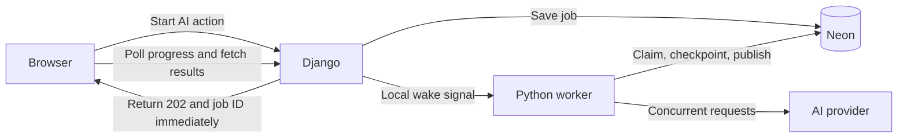

# Background AI jobs

Branch: `feat/background-ai-jobs`. Step 1 is implemented and uncommitted for owner review; execution remains disabled.

## Design

Run one Python background worker beside Gunicorn in the existing Render container. Neon stores jobs, input snapshots and checkpoints. Reuse the current AI services and quotas; no additional hosting service or recurring renewal is required.

**Scope.** Every AI action uses this system: question extraction, reference answers, rubrics and grading. Answer mapping is an internal grading step. Manual edits, uploads, extraction preview, finalization and exports remain normal requests.

**Concurrency and results.** Support up to ten eligible students with ten questions each. Start with three concurrent AI calls globally, configurable through env variables. Students run in a rolling window: when one finishes, publish that student's result and start another immediately. Each student's mapping and questions run sequentially, with private checkpoints after each step. Publish all of that student's answers, criterion scores/feedback and totals together; never wait for the entire batch or expose partial new grades. Other students continue if one fails. Interactive generation gets priority between grading steps, with fairness to prevent starvation.

**Persistence and recovery.** Store owned jobs, child jobs for batches, versioned input snapshots, step outputs, attempts linked to usage reservations, and expiring claims with heartbeats. Short database locks enforce global concurrency and duplicate protection, including overlapping containers. Verify claim ownership before writing; never hold a transaction during an AI call. On restart, reuse completed checkpoints and continue unfinished work. A response saved before publication can be published without another AI call. Unsupported job versions pause safely.

**Worker lifecycle.** A small supervisor runs one worker process and Gunicorn, forwards shutdown signals and exits if either process dies, allowing Render to restart the service. Keeping the worker outside Gunicorn protects it from web-worker recycling. Wake it after a job transaction commits using a private local socket. Scan on startup, web-worker restart, progress requests and while work is active; wait locally when idle so constant polling doesn't keep Neon awake. Missed notifications cannot erase accepted jobs. Use the same supervised startup in Docker and an explicit worker command for source development.

**Render sleep.** Work stops while Render is stopped and resumes when an incoming request wakes it. Closing the browser does not cancel a job, but can allow the service to sleep. Fifteen-minute completion is a demo target, not a guarantee. Do not add artificial keep-alive traffic.

**Safe updates and costs.** Grade ungraded/failed submissions by default; regrading is explicit and keeps old published grades until replacement succeeds. Preserve teacher overrides and dirty drafts. Snapshot questions, answers, rubrics, submission text, model/reasoning and prompt/schema versions; changed/deleted inputs supersede unfinished results. Generation fills missing content by default and confirms replacement; bulk replacements remain atomic. Preserve ownership, session/CSRF checks, queue limits and existing AI quotas, including the external $5 monthly cap.

Retry known safe transient failures with bounded backoff. If a request may have been billed but its response was lost, require explicit retry instead of silently repeating it; retain its usage reservation. Quota exhaustion pauses work. Cancellation stops future steps/publication but cannot undo an in-flight charge or completed student results. Keep errors/logs safe and prune old diagnostics without deleting active jobs or published grades.

**API and frontend.** Existing AI action URLs return `202` job receipts. Add owned job list/detail, cancel and explicit retry/resume endpoints; automatic OpenAPI describes their contracts. Admission is atomic and idempotent, including competing requests for the same target. Known worker unavailability returns a clear error. The frontend rediscovers jobs after refresh/sign-in and polls roughly every three seconds while visible, with error backoff. A workspace indicator keeps jobs accessible across navigation. Show scoped loading, queued/running/failed states and per-student completion; retain prior complete results during regrading and protect unrelated unsaved edits.

**Configuration and rollout.** Group quoted settings in `.env.example`: feature flag, global/student concurrency, leases/heartbeats, active scans, safe retries, drain interval, queue caps and the 10 × 10 grading limits. Keep model/reasoning and credentials in the existing ignored env files. Use additive migrations, preserving production accounts/uploads/grades. Keep the new mode disabled until backend and frontend are ready; rollback pauses new admission and retains compatible jobs/checkpoints. Verify SQLite local setup separately from PostgreSQL concurrency guarantees.

## Step 1 implementation

The `ai_jobs` app stores jobs, ordered checkpoints, billable attempts, target claims and a singleton admission lock. Internal admission captures immutable versioned inputs, checks ownership/readiness, prevents overlapping bulk/single work and admits entire batches atomically. Default capacity is 20 executable jobs per teacher and 50 globally; paused jobs count, batch parents do not. Background grading admits at most 10 students × 10 questions; the current synchronous limits remain unchanged.

Owned metadata endpoints are `GET /api/ai/jobs/`, `GET /api/ai/jobs/{id}/`, `POST /api/ai/jobs/{id}/cancel/` and `POST /api/ai/jobs/{id}/retry/`. Lists are paginated and filterable by assignment/state; batch detail includes individual student jobs. Snapshots/checkpoints/provider identifiers are private. Session authentication and CSRF apply. Cancellation retains completed work and holds running claims until worker acknowledgement. The internal retry service preserves checkpoints and reservations, rechecks inputs/capacity/targets and requires acknowledgement of potentially repeated charges.

There is no public job-creation endpoint yet. Existing AI buttons still use their current routes. Public retry returns 503 until worker integration; setting the staged feature flag cannot enable execution in this release. The additive migration creates only job tables and their coordinator. Branch CI verifies changes without publishing or deploying this feature branch.

Verification: 223 backend tests passed on disposable PostgreSQL 18, including four cross-connection admission races and a data-preserving migration upgrade. SQLite passed the 38 applicable job tests; four PostgreSQL concurrency tests were skipped. Repository lint/format, generated OpenAPI validation and migration consistency checks passed. No provider requests or production migrations were made for step 1.

## Execution plan: five commits

For **every step**: implement and test → explain the uncommitted changes → **owner reviews** → commit only after approval. Then proceed when authorized. This document revision stays uncommitted for review and is included with step 1; the earlier design-only commit remains the baseline. No automatic feature merge or deployment.

| Step / commit message                                       | Changes                                                                                                                                                                                                                    | Verification                                                                                                                                                                                                                         |
| ----------------------------------------------------------- | -------------------------------------------------------------------------------------------------------------------------------------------------------------------------------------------------------------------------- | ------------------------------------------------------------------------------------------------------------------------------------------------------------------------------------------------------------------------------------ |
| 1. `feat: add persistent AI job records and APIs`           | Include this revised design; add job/step/attempt records, snapshots, additive migrations, admission/idempotency, target/queue guards and owned status/cancel/retry contracts. Enable verification-only CI on this branch. | Concurrent admission, ownership/CSRF, duplicate requests, atomic batches, schema generation and upgrade without data loss. No provider calls during admission.                                                                       |
| 2. `feat: run resumable AI jobs in the Render container`    | Implement checkpointed execution for every AI operation, guarded publication and usage accounting; add scheduler, leases, safe retries, local wake signals, supervisor and Docker/source startup. Keep job mode disabled.  | Reused checkpoints, prompt/rubric correctness, complete student results, preserved edits, changed inputs, rolling concurrency, worker death/restart, lost notifications and idle behavior.                                           |
| 3. `feat: connect AI actions to background job progress`    | Wire every AI endpoint and bulk operation to jobs; add shared frontend polling/discovery, workspace indicator, scoped buttons, progress, cancel/retry and independent student updates. Retain staged mode compatibility.   | Prompt responses; 10 × 10 admission; one student available while another runs; no partial grades; navigation/refresh/logout/relogin; generation, draft protection, safe errors and accessibility.                                    |
| 4. `test: verify AI job recovery and demo capacity`         | Add cross-process fault tests and constrained container checks; record concurrency, latency/memory and restart evidence without private data.                                                                              | Delayed 10 × 10 workload at 0.1 CPU/512 MiB, initially targeting under 450 MiB; mapping/question/publication crashes, expired claims, duplicate signals, database outages, uncertain charges, quota races and persistent local data. |
| 5. `feat: enable background AI jobs and document operation` | Enable coordinated job mode, remove obsolete synchronous AI paths, finalize env/setup/rollback docs and update the production plan.                                                                                        | Full checks/builds; worker readiness, job-version compatibility and migration upgrade. After owner-approved merge, verify automatic deployment, synthetic AI progress, complete per-student results and restart/idle recovery.       |

Each step includes its own meaningful tests; step 4 adds system-level evidence. Use disposable databases or isolated development branches for failure tests. Existing unrelated UX findings and autonomous processing while Render sleeps remain deferred.

References: [Render lifecycle](https://render.com/docs/free), [Django transactions](https://docs.djangoproject.com/en/5.2/topics/db/transactions/), [PostgreSQL locks](https://www.postgresql.org/docs/current/explicit-locking.html).
