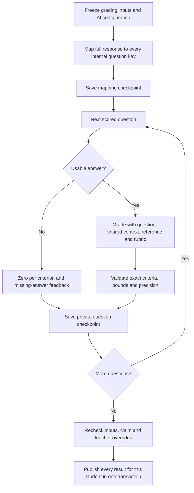

# Grading workflow and processing

The teacher prepares the grading inputs, AI proposes criterion scores, and the teacher reviews the published result. All AI actions are background jobs; manual editing and finalization remain normal requests.

## Teacher workflow

```mermaid
flowchart LR
    Source["Assignment text or TXT/PDF"] --> Questions["Questions and marks"]
    Questions --> References["Reference answers"]
    References --> Rubric["Rubric criteria and points"]
    Rubric --> Intake["Student submissions or CSV"]
    Intake --> Grade["Background grading"]
    Grade --> Review["Editable criterion review"]
    Review --> Finalize["Save and finalize"]
    Finalize --> Export["CSV results"]
```



1. **Assignment overview:** paste text or upload TXT/PDF. Replacing a file explicitly selects extracted file text or retained edited text; extraction can be previewed before saving. Updating the source does not automatically regenerate questions.
2. **Questions:** extract or create scored questions and unscored shared context. Scored questions require text and positive marks. AI preserves explicit marks and proposes allocations when absent, using the whole assignment and any stated total. Fully marked supported structured text can use deterministic extraction. Teachers review every proposed allocation.
3. **Reference answers:** create/edit the expected answer for each scored question. Generation fills missing answers by default; replacement is explicit and confirmed.
4. **Rubric:** define positive criteria whose points sum exactly to the question's marks. AI generation requires a reference answer and is validated before publication. The assignment maximum is the sum of scored-question maxima.
5. **Submissions:** add a named student's text/file, or import CSV. Student number is optional. Queues show searchable/filterable metadata rather than full answers. Full answers and feedback belong on the individual review page.
6. **Review:** inspect and edit each criterion's score/feedback, question feedback and review flags. Ungraded submissions provide blank editors for manual grading. Totals update from the criterion scores.
7. **Finalize/export:** Save and finalize saves drafts before the server verifies completeness, score bounds and cleared review flags. Editing/regrading reopens a finalized result. CSV currently exports all submission statuses, including unfinished rows.

Save and continue saves valid drafts before navigation. Workspace navigation offers Save/Discard/Stay for unsaved changes; reload/closure uses the browser warning. Drafts are in memory and do not survive browser restart.

## Admission and duplicate protection

An AI action validates teacher ownership, assignment readiness, explicit replacement/regrading, batch limits and worker readiness. Admission atomically stores an immutable snapshot, target claims and ordered steps, then returns `202` with a job ID. The frontend tracks the receipt and polls visible runnable jobs approximately every three seconds, with error backoff and no periodic polling for finished/paused work.

The same owner-scoped idempotency key replays the original receipt instead of creating another job. The frontend retains the key if acceptance cannot be confirmed. Active target claims prevent single/bulk overlap. Default grading selects eligible pending/failed submissions; replacing an existing grade requires explicit regrading. Default limits are ten students per batch, ten scored questions per student, three concurrent calls and three active students with PostgreSQL.

A batch parent tracks progress; each student has an independent child job. Admission validates the batch before accepting it. A student's later provider failure does not erase other students' published grades.

## What one student job does



**Mapping:** one AI call sees the entire submission and the structured question list, including shared context. It returns an excerpt and mapping confidence for every internal question key. Duplicate, unknown or missing keys are rejected. An unanswered question has an empty excerpt.

**Criterion grading:** for each answered question, the prompt includes its wording, shared context, maximum, saved reference answer, every rubric criterion's stable ID/title/description/maximum, and the mapped student excerpt. Both the reference and rubric are used. The structured response must contain every criterion exactly once, with an in-bounds score having at most two decimal places and individual feedback. It also includes overall feedback, a brief reasoning summary, model-reported confidence and a review flag.

The application validates the response and calculates totals itself:

```text
Question score = sum of that question's criterion scores
Submission score = sum of complete question scores
Assignment maximum = sum of scored question maxima
```

An unanswered question receives zero for every criterion and missing-answer feedback without a grading provider call. With ten answered questions, one student normally needs eleven calls: one mapping plus ten grading calls. Ten such students need 110 calls. A question-generation job can use deterministic extraction or an additional repair request; its call count is not the grading formula.

Blank manual criterion scores mean unfinished work, rather than zero. Partial reviews can be saved but cannot be finalized. Zero is a valid score and remains zero in totals and exports. Earlier aggregate-only results retain their recorded grade; Graider does not fabricate historical criterion scores.

## Concurrency and publication

The worker admits students in a rolling window. With the default three-student/three-call configuration, each student advances through mapping and questions sequentially; different students overlap. When one completes, its entire result is committed and another student enters the window. Interactive answer/rubric/question jobs receive priority between grading steps, with a fairness threshold to avoid starvation.

Checkpoints are private. The frontend receives all question results for a student after publication, rather than partially replacing that student's old grade. Other students can remain queued/running. Bulk reference/rubric replacement likewise waits for all selected outputs before publishing atomically. Unrelated dirty frontend editors are preserved and refresh is deferred until drafts are resolved.

Publication compares the frozen inputs with the current records. Changed/deleted inputs supersede unfinished work. Existing teacher criterion overrides are preserved when criterion IDs and maxima remain compatible. A changed rubric that cannot preserve an override automatically requires attention instead of silently discarding it. Legacy manually overridden aggregate totals also require manual review before criterion regrading.

This protection covers unfinished work. Already-published grades are not automatically marked stale when inputs later change; [stale published grades](ROADMAP.md#user-experience) remain an open issue.

## Recovery, retries and accounting

Each step has an expiring claim and heartbeat. Usage is reserved before dispatch under short DB locks; the actual provider wait happens outside any database transaction. Successful responses are saved before advancing the checkpoint. Model/reasoning and snapshot/prompt/output versions are frozen so restart does not silently change the job recipe.

| Situation                               | Behavior                                                                                                                                      |
| --------------------------------------- | --------------------------------------------------------------------------------------------------------------------------------------------- |
| Process dies before dispatch            | Recover the claim and safely continue.                                                                                                        |
| Saved response/checkpoint exists        | Reuse it and continue without repeating that provider call.                                                                                   |
| Publication is interrupted              | The transaction rolls back; publish the complete saved result on recovery.                                                                    |
| Dispatch occurred but response was lost | Pause as `needs_attention`, retain the uncertain reservation and require explicit acknowledgement before another potentially charged request. |
| Known-safe transient rejection          | Apply bounded retry/backoff, default two retries with a ten-second initial delay.                                                             |
| Token allowance exhausted               | Pause as `paused_quota`; Resume never bypasses quotas.                                                                                        |
| Unsupported saved job version           | Pause for a compatible worker or a deliberate new request.                                                                                    |
| Inputs changed                          | Mark `superseded`; start a request using the current inputs.                                                                                  |
| Cancellation                            | Stop future execution/publication; preserve published students. An in-flight charge cannot be undone.                                         |

Saved responses prevent repeat calls where their outcome is known. External requests are not guaranteed exactly once across crashes. Render sleep also stops execution; persisted work resumes after the service wakes. [Architecture](ARCHITECTURE.md) explains coordination, [benchmarks](BENCHMARKS.md) records measured timings, and [setup](SETUP.md#maintenance-and-recovery) covers operation.
